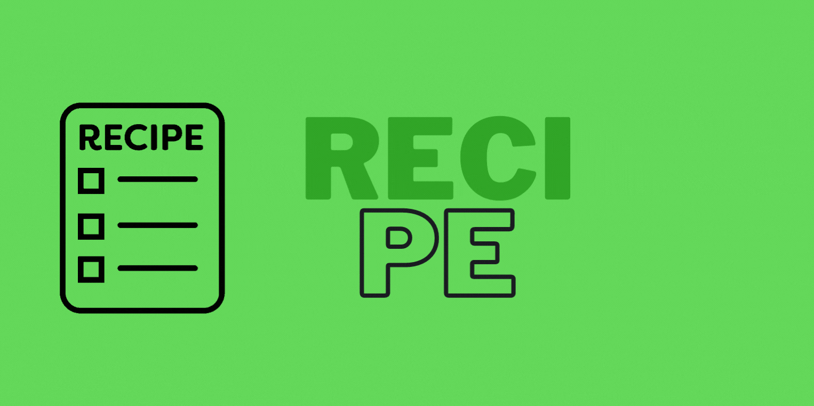

 

Ideia retirada do <a href="https://github.com/florinpop17/app-ideas"  target="">App ideas</a>

O objetivo do aplicativo Receita é ajudar o usuário a gerenciar suas receitas favoritas.

  

<h1>☑️ Recursos</h1>
    -[x] O usuário pode ver o mostruário de receitas  
    -[x] O usuário pode adicionar uma nova receita  
    -[x] O usuário pode editar uma receita  
    -[x] O usuário pode deletar uma receita

  

<h1>🛠️ Tecnologias</h1>
    <ul>
        <li>HTML</li>
        <li>CSS</li>
        <li>Javascript</li>
    </ul>

 

Feito com ❤️ por Sara Brito

 
+

 
  
  

